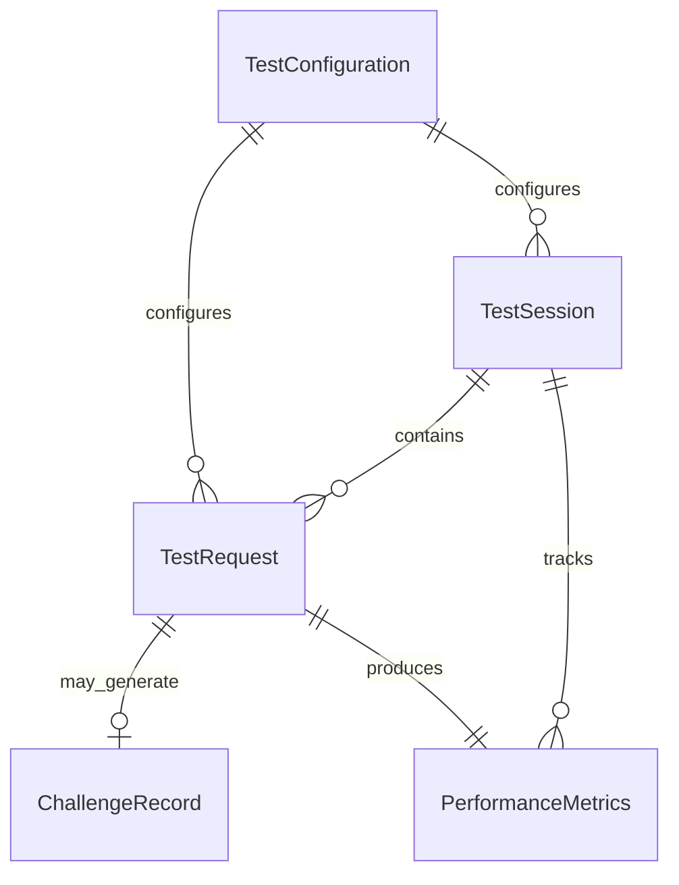

# Data Model: High-Performance Browser Emulation Research Tool

**Feature**: High-Performance Browser Emulation Research Tool
**Date**: 2025-01-17
**Status**: Design Complete

## Entity Overview

The browser emulation research tool operates with five core entities that capture the essential data flows for testing Cloudflare-protected infrastructure. Each entity is designed for stateless operation and high-concurrency access patterns.

## 1. Test Request

**Purpose**: Represents a single browser emulation request with configuration and timing data

**Attributes**:
- `request_id`: Unique identifier (UUID4)
- `url`: Target URL for the request
- `method`: HTTP method (GET, POST, PUT, DELETE)
- `headers`: Dictionary of HTTP headers
- `body`: Request payload (optional)
- `browser_config`: Browser fingerprint configuration
- `proxy_config`: Proxy settings (optional)
- `timeout`: Request timeout in seconds
- `created_at`: Timestamp of request creation
- `started_at`: Timestamp when request execution began
- `completed_at`: Timestamp when request completed

**Relationships**:
- Belongs to one Test Session
- May generate one Challenge Record
- Produces one Performance Metrics record

**Validation Rules**:
- URL must be valid HTTP/HTTPS format
- Timeout must be between 1-300 seconds
- Method must be standard HTTP method
- Headers must be valid HTTP header format

**State Transitions**:
```
Created → Queued → Executing → Completed
                           → Failed
                           → Timeout
```

## 2. Test Session

**Purpose**: Collection of related test requests with shared configuration and metrics

**Attributes**:
- `session_id`: Unique identifier (UUID4)
- `name`: Human-readable session name
- `description`: Optional session description
- `browser_version`: Chrome version being emulated
- `concurrency_limit`: Maximum concurrent requests
- `rate_limit`: Requests per second limit
- `total_requests`: Number of requests in session
- `completed_requests`: Number of completed requests
- `failed_requests`: Number of failed requests
- `started_at`: Session start timestamp
- `completed_at`: Session completion timestamp
- `status`: Current session status

**Relationships**:
- Contains multiple Test Requests
- Contains multiple Performance Metrics
- May contain multiple Challenge Records

**Validation Rules**:
- Concurrency limit must be 1-10,000
- Rate limit must be positive number
- Browser version must follow Chrome version format
- Status must be valid session state

**State Transitions**:
```
Created → Running → Completed
                 → Cancelled
                 → Failed
```

## 3. Challenge Record

**Purpose**: Information about security challenges encountered during testing

**Attributes**:
- `challenge_id`: Unique identifier (UUID4)
- `request_id`: Associated request identifier
- `challenge_type`: Type of challenge detected
- `challenge_url`: URL where challenge was encountered
- `challenge_html`: Raw challenge HTML content
- `javascript_code`: Extracted JavaScript code
- `solution_data`: Computed challenge solution
- `cf_clearance`: Extracted clearance cookie value
- `solve_duration`: Time taken to solve challenge (ms)
- `success`: Whether challenge was solved successfully
- `error_message`: Error details if solution failed
- `detected_at`: When challenge was first detected
- `solved_at`: When challenge was successfully solved

**Relationships**:
- Belongs to one Test Request
- Belongs to one Test Session

**Validation Rules**:
- Challenge type must be enum value (JS, Turnstile, Managed, RateLimit)
- Solution duration must be positive number
- Success must be boolean
- Clearance cookie must be valid format

**Enumerated Values**:
```python
class ChallengeType(Enum):
    JAVASCRIPT = "javascript"
    TURNSTILE = "turnstile"
    MANAGED = "managed"
    RATE_LIMIT = "rate_limit"
    UNKNOWN = "unknown"
```

## 4. Performance Metrics

**Purpose**: Timing, throughput, and resource usage measurements from test runs

**Attributes**:
- `metrics_id`: Unique identifier (UUID4)
- `session_id`: Associated session identifier
- `request_id`: Associated request identifier (optional)
- `metric_type`: Type of metric being recorded
- `timestamp`: When metric was recorded
- `duration_ms`: Operation duration in milliseconds
- `memory_mb`: Memory usage in megabytes
- `cpu_percent`: CPU utilization percentage
- `connections_active`: Number of active connections
- `requests_per_second`: Throughput measurement
- `success_rate`: Percentage of successful requests
- `error_count`: Number of errors encountered
- `challenge_solve_rate`: Challenge success percentage

**Relationships**:
- Belongs to one Test Session
- May belong to one Test Request

**Validation Rules**:
- Duration must be non-negative
- Memory usage must be positive
- CPU percent must be 0-100
- Success rate must be 0-100
- Timestamp must be valid ISO format

**Metric Types**:
```python
class MetricType(Enum):
    REQUEST_TIMING = "request_timing"
    SESSION_SUMMARY = "session_summary"
    RESOURCE_USAGE = "resource_usage"
    THROUGHPUT = "throughput"
    CHALLENGE_PERFORMANCE = "challenge_performance"
```

## 5. Test Configuration

**Purpose**: Settings controlling browser emulation behavior and test parameters

**Attributes**:
- `config_id`: Unique identifier (UUID4)
- `name`: Configuration profile name
- `browser_version`: Chrome version to emulate
- `user_agent`: Custom user agent string
- `viewport_width`: Browser viewport width
- `viewport_height`: Browser viewport height
- `timezone`: Browser timezone setting
- `language`: Browser language setting
- `platform`: Operating system platform
- `headers_profile`: Default headers configuration
- `tls_profile`: TLS fingerprint settings
- `proxy_settings`: Default proxy configuration
- `rate_limits`: Default rate limiting rules
- `challenge_settings`: Challenge handling configuration
- `created_at`: Configuration creation timestamp
- `updated_at`: Last modification timestamp

**Relationships**:
- Used by multiple Test Requests
- Used by multiple Test Sessions

**Validation Rules**:
- Browser version must be valid Chrome version
- Viewport dimensions must be positive integers
- Timezone must be valid IANA timezone
- Language must be valid locale code
- Platform must be supported OS value

**Configuration Profiles**:
```python
class BrowserProfile(Enum):
    CHROME_WINDOWS = "chrome_windows"
    CHROME_MACOS = "chrome_macos"
    CHROME_LINUX = "chrome_linux"
    CHROME_MOBILE = "chrome_mobile"
```

## Data Relationships



## Storage Considerations

**In-Memory Storage**:
- All entities stored in memory for performance
- No persistent storage required for stateless operation
- Memory usage optimized for 10,000+ concurrent requests

**Data Retention**:
- Test data retained only during session lifetime
- Optional export to JSON/CSV for analysis
- Automatic cleanup on session completion

**Concurrency Model**:
- Entities designed for async/await access
- No locking required in single-threaded asyncio
- Immutable data structures where possible

## Export Schema

**JSON Export Format**:
```json
{
  "session": {
    "session_id": "uuid",
    "name": "string",
    "summary": {...}
  },
  "requests": [
    {
      "request_id": "uuid",
      "url": "string",
      "status": "completed",
      "metrics": {...}
    }
  ],
  "challenges": [
    {
      "challenge_id": "uuid",
      "type": "javascript",
      "solved": true,
      "duration_ms": 1250
    }
  ],
  "performance": {
    "total_requests": 10000,
    "success_rate": 99.9,
    "avg_response_time": 145,
    "challenges_encountered": 156,
    "challenge_solve_rate": 98.7
  }
}
```

This data model supports the core requirements for browser emulation research while maintaining the stateless, high-performance architecture needed for concurrent testing at scale.